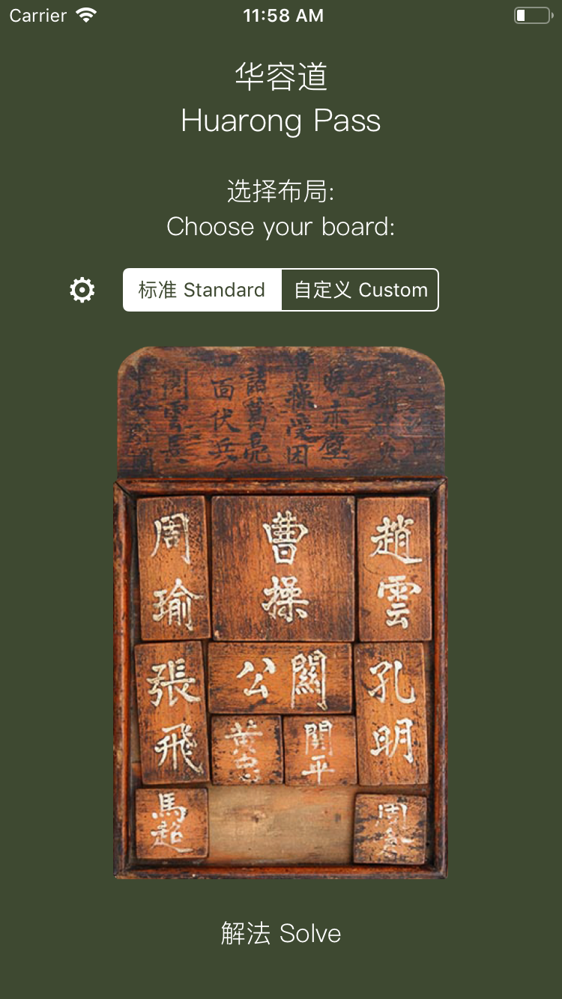
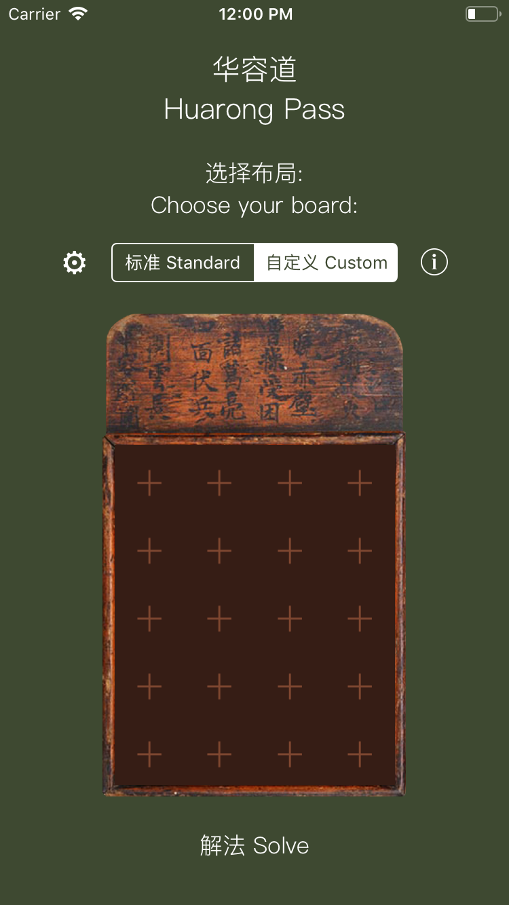
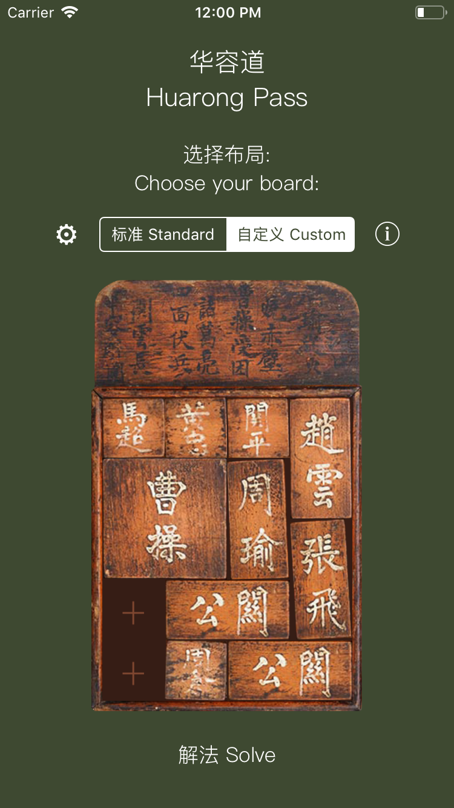
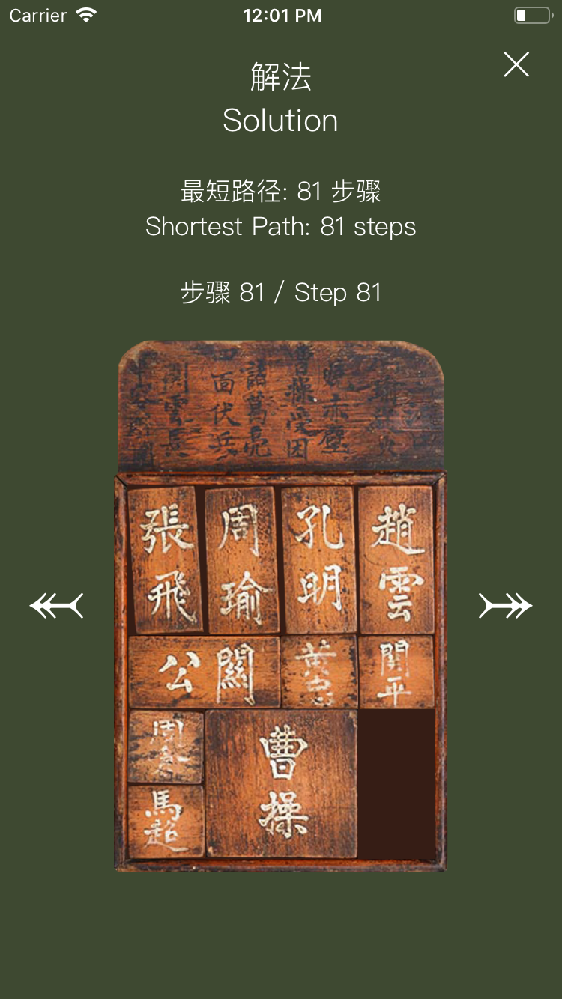

#  Huarong Pass (华容道)

## Description

An iOS app that solves the Huarong Pass sliding block puzzle, written in Swift. 

Some history about the puzzle (most commonly known as Klotski in the West):
- [Klotski](https://en.wikipedia.org/wiki/Klotski)
- [Huarong Pass](http://chinesepuzzles.org/huarong-pass-sliding-block-puzzle/)

The app uses the [breadth-first search algorithm](https://en.wikipedia.org/wiki/Breadth-first_search) to find the optimal solution to the puzzle i.e. the fewest steps required for the main piece (Cao Cao) to reach the exit. It is also guaranteed to find a solution if there is one. If there are other solutions with the same amounts of steps, it just shows one of them.

It also makes use of [Zobrist hashing](https://en.wikipedia.org/wiki/Zobrist_hashing) to represent the state of the board and to compute all the possible moves for the next boards. It is what yields the incredible performance of this app. (0.666s last time I tested on my Macbook for the standard board :])

You can test the app either on the Xcode Simulator or by installing it on your iPhone/iPad through Xcode.

## Features

- Choose the standard board or make your own custom board by adding/removing pieces from the board
- Count two-block moves in different directions as one step (leads to the 81-step solution for the standard board) or count two-block moves in the same direction only as one step (leads to a 91-step solution for the standard board)
- Start and cancel the solving execution, which happens on a background thread
- Step through all the board configurations in the optimal solution

## Screenshots

The standard board |  The custom board | The custom board with selected pieces | The final step of the solution to the standard board
:-------------------------:|:-------------------------:|:-------------------------:|:-------------------------:
  |    |    |  

## Possible Future Features

- Play the game by sliding the puzzle pieces
- If you're stuck, show the next move as a hint, or if you give up, show the solution
- Add more preset boards, ranked by difficulty level (amount of steps it takes)
- Generate random boards and rank them by difficulty
- Different board sizes, piece sizes/shapes and exit(s)

## Credits

- [Yongsi Chen](https://www.linkedin.com/in/yongsi-c-24726583) for the Chinese translation <3
- [Yong Su](https://github.com/jeantimex/klotski) for the inspiration about the Zobrist hashes
- [chinesepuzzles.org](http://chinesepuzzles.org/) for the wooden board image
